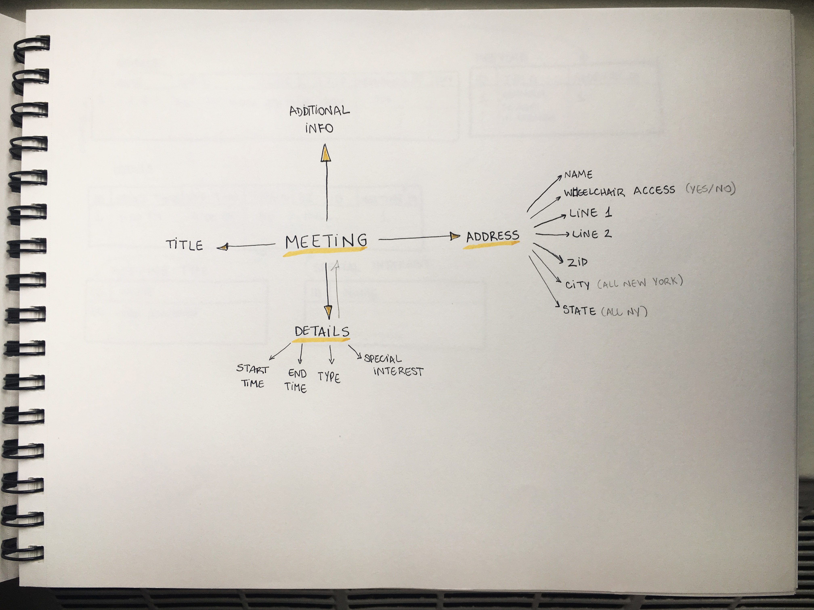
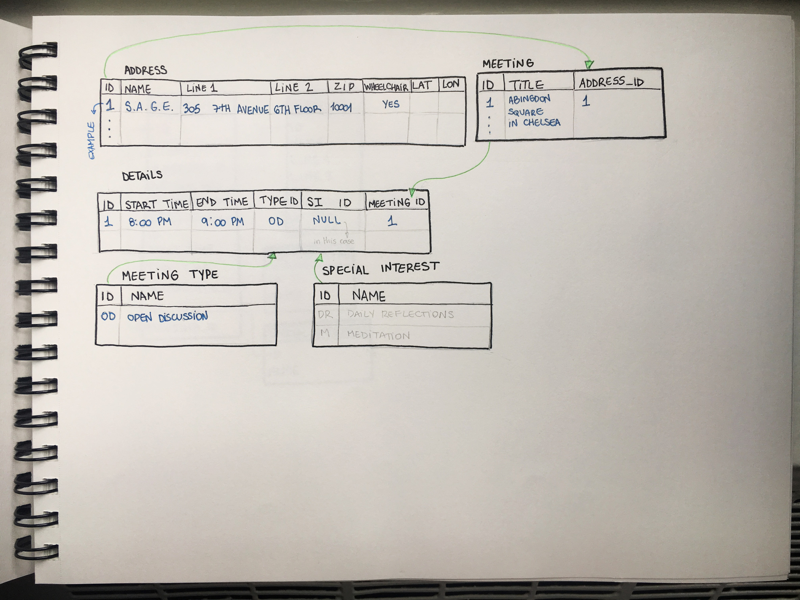
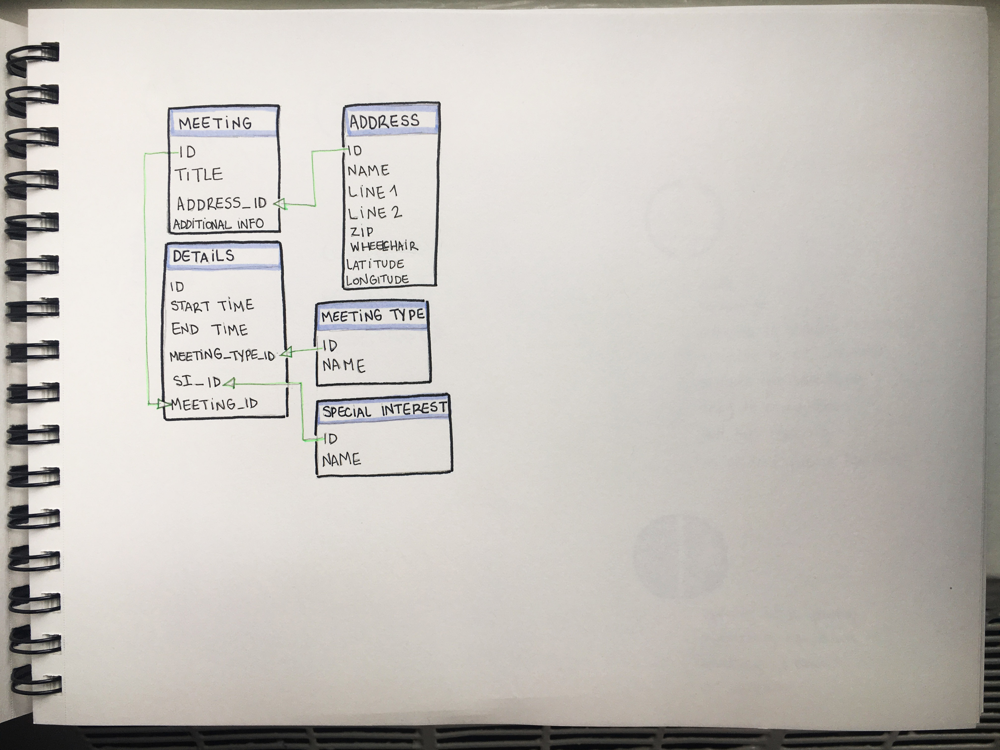

# Final Assignment 1

*The final application*: http://18.222.88.51:8080/

## Part 1

The assignment started since week 1 of the course, where I extracted the html code from the 10 zones of the AA meetings across Manhattan. 
The original webpages were 
```
https://parsons.nyc/aa/m01.html  
https://parsons.nyc/aa/m02.html  
https://parsons.nyc/aa/m03.html  
https://parsons.nyc/aa/m04.html  
https://parsons.nyc/aa/m05.html  
https://parsons.nyc/aa/m06.html  
https://parsons.nyc/aa/m07.html  
https://parsons.nyc/aa/m08.html  
https://parsons.nyc/aa/m09.html  
https://parsons.nyc/aa/m10.html   
```
And the resulting txt files can be found in [Week 1](https://github.com/nataly-klajner/data-structures/tree/master/week1)

## Part 2

For the next part, I worked with the content of zone 4 of the AA meetings addresses. After creating txt files on the Assignment 1, I looked at the code to find the addresses. They were inside the first table cell (TD) of each table row (TR).

The useful files can be found in [Week 2](https://github.com/nataly-klajner/data-structures/tree/master/week2)

As there were many TRs on the code, I specified the ones to select with their style (tr[style="margin-bottom:10px), and then to select the first TD only (td:first-of-type). That was stored in a var selectionOfTheTD.

Inside the function getAddressFromTD:

The var cheerioTDElement = $(element); stores the result of the function that converts the html code to cheerio, as it wouldn't be possible to use the method .text with an html element.
var TDTextContent = cheerioTDElement.text(); holds the text content from the TDs. The method .text gets the text content from the element.
In var arrayOfLines = TDTextContent.split("\n"); the .split() method was used to split the text into separate lines.
In var addressLine = arrayOfLines[3]; the fourth line is selected out of the text of each TD.
var address = addressLine.trim(); is being used to trim the extra space of indent before the text lines.
The function will return the address of each TD, with "return address;"
I used the cheerio methods .map() to loop over every TD selected on line 16, converting them using the getAddressFromTD function. var result = selectionOfTheTD.map(getAddressFromTD).get();

I created two files, one txt and one json. Json stores the addresses in a lined text box, which seemes to be helpful for the next part of this project.

JSON.stringify(result, null, 4)); was used to print the var result, null as nothing was to be replaced, and 4 is the amount of indent for each line.

Used links: https://gist.github.com/magicznyleszek/809a69dd05e1d5f12d01

https://www.npmjs.com/package/cheerio

https://developer.mozilla.org/en-US/docs/Web/JavaScript/Reference/Global_Objects/String/split

## Part 3

Using the .json result from the weekly assignment 2, I created an account on https://geoservices.tamu.edu/ to get the latitude and longitude of each meeting address in zone 4.

The code written for this step can be found in [Week 3](https://github.com/nataly-klajner/data-structures/tree/master/week3)

The result was a .json file with an array of objects, each object containing a meeting address (zone 4) and its latitude and longitude values.

## Part 4

The [Week 4](https://github.com/nataly-klajner/data-structures/tree/master/week4) assignment included sketching and planning how to populate the database for the zone 4 meetings info, 
as well as creating and populating it.

My skecthes:





On [install.js](https://github.com/nataly-klajner/data-structures/blob/master/week4/install.js) I used the starter code, changing the info for my credentials, to create the table where the data for the meetings of zone 04 would be inserted.
To verify that the code worked I tried running it again, where an error message stated that the table already existed, proving it worked.
The name of the table is aalocations, and its contents are (address varchar(100), lat double precision, long double precision).

On [run.js](https://github.com/nataly-klajner/data-structures/blob/master/week4/run.js) I worked on the starter code to insert the meetings data I had stored in a json file on assignment 3.
Aside for changing the credentials, I changed where it was written "lng" to "lon", which was how I had longitude written on my file.

## Part 5

The next step was writing and executing the query for this data. Since I was working with the data from zone 4 only, qhich consisted of address, lat and long, I wrote the query based on this.
This initial query can be found in [Week 6](https://github.com/nataly-klajner/data-structures/blob/master/week6/week6-aa.js)
 
## Part 6

For this next step we could work in teams, and I worked with Shefali. We divided between us the zones to work with and retraced our steps since week 2, gathering the important data from each zone. 
Instead of extracting only the addresses we worked with the location title, start and end time, day of the week, meeting types and whether or not it had wheelchair access.

Since many locations had more than 1 meeting, a loop had to be added to the code, and the result is that some addresses are repeated, in order to create on object for each meeting.

Once again we used the code from [Week 3](https://github.com/nataly-klajner/data-structures/tree/master/week3) to get the geo location of all the meetings.

When we had all the data in .json files, we installed and populated a new database that served us until the final assignment.

The resulting .json files and code can be found in [Week 7.3](https://github.com/nataly-klajner/data-structures/tree/master/week7.3)

## Part 7

With the [Week 10](https://github.com/nataly-klajner/data-structures/tree/master/week10) assignment I used exprees in node.js to create a web server application for all the 3 assignments we had been working on. 

For the AA meetings, I wrote a query to select the meetings that happened on Sunday, at 6 PM and had wheelchair access, showing their location, start time as well. 

The result can be seen in http://18.222.88.51:8080/aameetings

In the application of the final assignment this part can also be seen under "query week 10"

## Part 8

For this weekly assignment I skecthed out how I imagined the visual representation of the map would look like, and decided that the starting point would be the geo location of the Grand Central Terminal.

The sketching can be found in [Week 11](https://github.com/nataly-klajner/data-structures/blob/master/week11/Nataly_assignment11.pdf)

## Part 9 - FINAL

For the final part I used the query previously written but included more info, so now the Sunday 6 PM meetings are displayed acroos the map of Manhattan, and clicking in each location pin we can see:
- Meeting Location Title
- Address
- Start Time
- Day of the Week
- Meeting Type
- Wheelchair access (stated with true or false)

The visualization of the map was possible using the Leaflet open source library and the starter code.

All useful files can be found in [Final Assignment 1]()

## Next Steps

For the future I would like to:
- Style the map, make it more simple so the meetings are more evident than the background
- Style the text (now in json mode) using typography to make the meeting details as clear as possible for the user.
