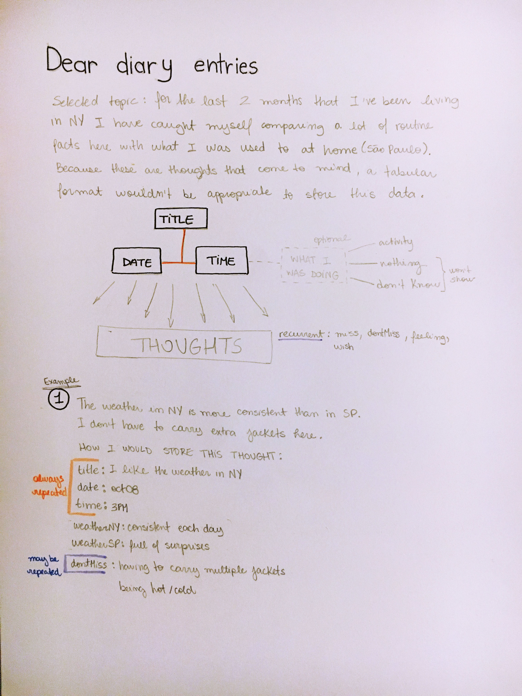

# Final Assignment 2

*The final application*: http://18.222.88.51:8080/

## Part 1

To begin with the Dear Diary assignment, I created a table in DynamoDB.

In the sketches uploaded to [Week 5](https://github.com/nataly-klajner/data-structures/tree/master/week5) I tried to show my thoughts on how my entries for this assignments would be. As they are thoughts that cross my mind there was no way to display them in a tabular way, for each entry has its own piece of information that was important for me at that moment.

The code that was written uses a variable myItem to store the objects that contains strings for each entry. With dynamodb.putItem the new item is being stored in the Dear Diary table created. The last part of the code tells the console to log a success phrase.

For each entry the information was written in objetcs inside var myItem. As the dynamodb.putItem always calls for the same variable, for each new one that I wrote I commented out the previous entry.

## Part 2

The next step was writing and executing the query for this data. I decided my primary key (pk) will always be the date of the entry, in the format dec17 (as an example).
I wrote this query – [Week 6](https://github.com/nataly-klajner/data-structures/blob/master/week6/week6-diary.js) – to test selecting the entry that had the pk "oct08".

## Part 3

To make the Diary more interesting I wrote more entries, resulting in one month of logs. It had become a written record of my feelings living in NY.
[Here](https://github.com/nataly-klajner/data-structures/blob/master/week5/week5.js) is the code where it is possible to see all the entries I wrote.

## Part 4

With the [Week 10](https://github.com/nataly-klajner/data-structures/tree/master/week10) assignment I used exprees in node.js to create a web server application for all the 3 assignments we had been working on.

For the Dear Diary data the entries have 2 conditions:
- The entry will always be selected by the date, which is the primary key
- There is no interaction with the visual representation (unlike the AA meetings or the sensor)

The result can be seen in http://18.222.88.51:8080/deardiary

In the application of the final assignment this part can also be seen under "query week 10"

## Part 5

For this weekly assignment I skecthed out how I imagined the visual representation of the diary would look like.

The sketching can be found in [Week 11](https://github.com/nataly-klajner/data-structures/blob/master/week11/Nataly_assignment11.pdf)

## Part 6 - FINAL

Using the query from the previous Part 4, I included the diary query in the final [server.js](https://github.com/nataly-klajner/data-structures/blob/master/final.assignment.2/server.js)

The code in [diary.html](https://github.com/nataly-klajner/data-structures/blob/master/final.assignment.2/public/diary.html) is an example of how the visualization would look like.

## Next steps

To continue working on this database I need to make the final application work with the data from the diary, because so far what we see is the placeholder text.
