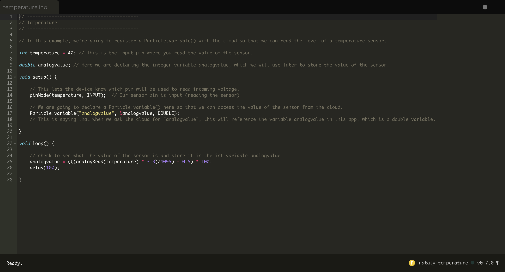
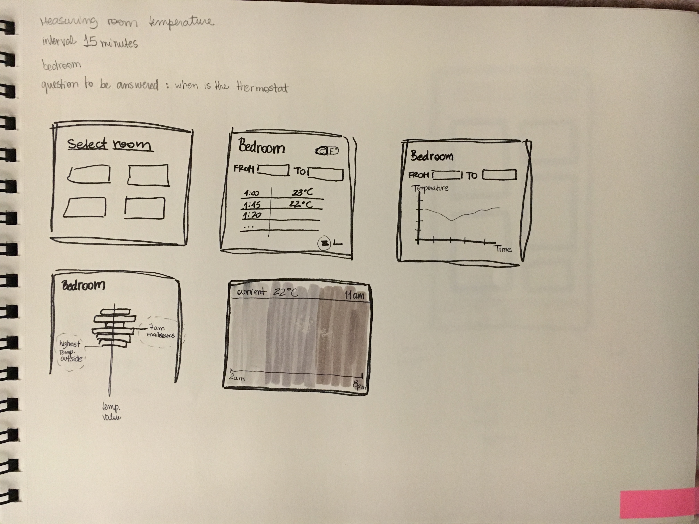

# Final Assignment 3

*The final application*: http://18.222.88.51:8080/

## Part 1

After setting up an account on the Particle platform, I learned to connect the temperature sensor to a network.

Using the starter code and making adaptations I managed to get the desired results. 

I set up the sensor in my bedroom (connected to my wi-fi network) because I decided that my goal was to measure the temperature there (I always wonder whether the thermostat was on, so that seemed like a good oportunity for that).

The code (written in https://build.particle.io/) can be seen in the image below:

Here is an screenshot of how the url including the devide id and token displayed the result:

In this .json code, the temperature can be seen as "result", in degrees Celsius.

## Part 2

Next I sketched a few ways I imagined this data could be visualized.

## Part 3

I created the app that would parse the result and insert the data into my database (temperature and date/time). 

For this I set up a new table using PostgreSQL as the database.

Finally I set the app to run every 5 minutes, so by the end of the day I would have enough data to create accurate averages.

I used the Table Plus app to check if the table was being populated like I intended.

The files for this part can be found in [Week 9](https://github.com/nataly-klajner/data-structures/tree/master/week9)

## Part 4

For this weekly assignment I skecthed out how I imagined the visual representation of the chart would look like. The intention was to see an average for each part of the day (morning, afternoon and evening).

The sketching can be found in [Week 11](https://github.com/nataly-klajner/data-structures/blob/master/week11/Nataly_assignment11.pdf)

## Part 5

With the [Week 10](https://github.com/nataly-klajner/data-structures/tree/master/week10) assignment I used exprees in node.js to create a web server application for all the 3 assignments we had been working on. 

For the temperature sensor, I wrote an SQL query to show the average value of each day the sensor was functioning. 

The result can be seen in http://18.222.88.51:8080/sensor

In the application of the final assignment this part can also be seen under "query week 10"

## Part 6 - FINAL

Using the query from the previous Part 5, I set the daily values to be represented in a bar chart. 
Horizontaly we can see the days, and vertically the temperature values increasing.

The user can see the default bars in blue, and when hovering over a bar it turns yellow and shows the average temperature for that specific day.

